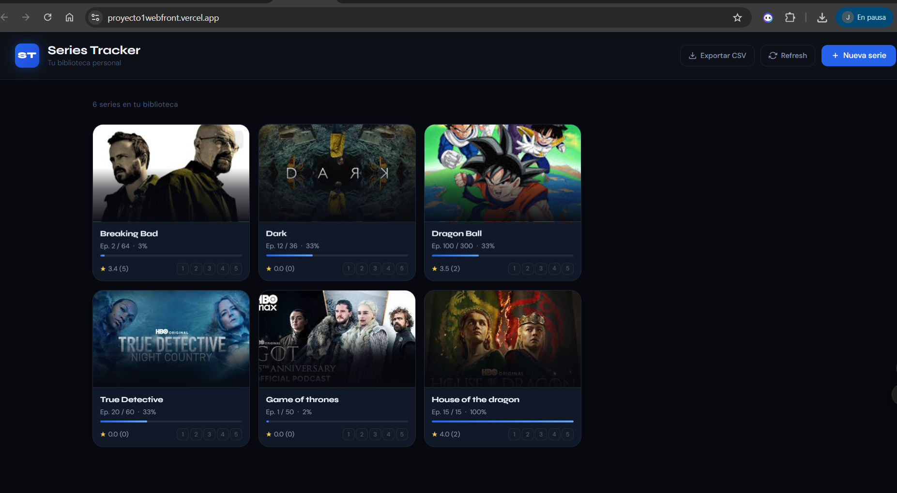

# 🎨 Series Tracker (Frontend)

Cliente web desarrollado con HTML, CSS y JavaScript vanilla que consume una API REST para gestionar series, episodios, ratings e imágenes.

---

## 🌐 Deploy

Frontend en producción:
 https://proyecto1webfront.vercel.app

Backend:
 https://proyecto1webbackend-production-d655.up.railway.app

---

## ⚙️ Cómo correr el proyecto localmente

### 1. Clonar repositorio

```bash
git clone https://github.com/JuanGualim/Proyecto1_Web_frontend
cd Proyecto1_Web_frontend
```

---

### 2. Abrir documento en navegador

Abrir archivo 

```bash
index.html
```

---

## Repositorio bakcend
```bash
https://github.com/JuanGualim/Proyecto1_Web_backend
```
---
## 🎨 Funcionalidades

- ✔ Listar series
- ✔ Crear nuevas series
- ✔ Editar series
- ✔ Eliminar series
- ✔ Subir imágenes
- ✔ Sistema de rating
- ✔ Exportar CSV
- ✔ UI moderna y responsive

---

## 🧩 Challenges implementados

- ✔ Exportar CSV generado manualmente en JavaScript
- ✔ Sistema de rating conectado al backend
- ✔ Subida de imágenes con preview
- ✔ UI personalizada y profesional

---

## 📸 Programa funcionando



---

##  Consumo de API

El frontend se comunica con el backend mediante fetch:

```javascript
const API = "https://proyecto1webbackend-production-d655.up.railway.app"
```

---

## Reflexión

El desarrollo del frontend sin frameworks permitió comprender profundamente el uso de fetch(), el manejo del DOM y la interacción directa con una API REST. Implementar funcionalidades como rating, subida de imágenes y exportación de CSV sin librerías externas representó un reto interesante.

El uso de Vercel para deploy facilitó la publicación rápida de una aplicación estática en producción. Aunque trabajar con JavaScript puro fue útil para reforzar fundamentos, en proyectos más grandes consideraría utilizar frameworks modernos para mejorar la escalabilidad y mantenimiento del código.

